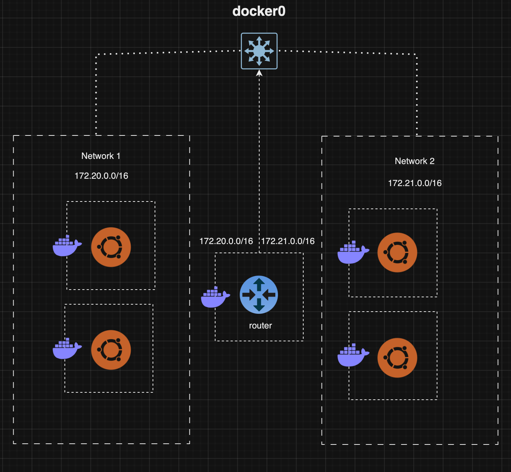
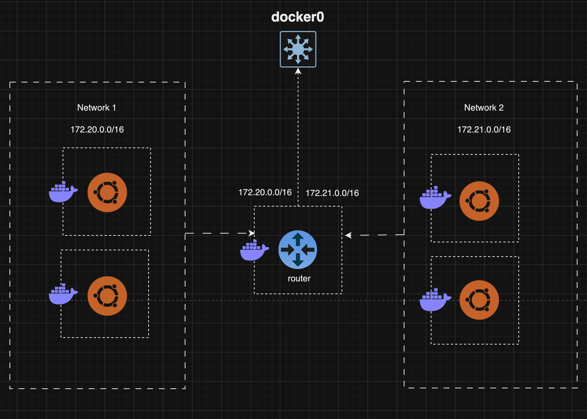

# Docker-Based Router 

## Overview

This project demonstrates the implementation of a router using Docker containers. The setup includes a router container and multiple client containers across two networks. The router container is configured to forward traffic between the two networks, allowing communication between containers in different networks.


## Network Diagram
### Initial Setup

### Final Setup

## Working
### Router Container
*`Password Configuration:` Setting root password for the router container. ## We will need it later for webmin login
```
echo 'root:pass123' | chpasswd
```
*`Package Installation:` Installs necessary packages for networking and web administration.
```
apt-get update &&
apt-get install -y curl iproute2 iputils-ping net-tools iptables mtr
```
*`Webmin Setup:` Downloads and installs Webmin for web-based administration.
```
curl -o setup-repos.sh https://raw.githubusercontent.com/webmin/webmin/master/setup-repos.sh &&
echo y | sh setup-repos.sh &&
apt-get install --install-recommends -y webmin
```
*`IP Forwarding:` Enables IP forwarding to allow packet routing.
```
echo 1 > /proc/sys/net/ipv4/ip_forward
```
*`NAT and Forwarding Rules:` Configures iptables for NAT (Network Address Translation) and packet forwarding between the networks.
```
iptables -t nat -A POSTROUTING -o eth0 -j MASQUERADE &&
iptables -A FORWARD -i eth0 -o eth1 -m state --state RELATED,ESTABLISHED -j ACCEPT &&
iptables -A FORWARD -i eth1 -o eth0 -j ACCEPT &&
iptables -A FORWARD -i eth0 -o eth2 -m state --state RELATED,ESTABLISHED -j ACCEPT &&
iptables -A FORWARD -i eth2 -o eth0 -j ACCEPT
```

- **MASQUERADE Rule:** Ensures that outgoing packets from `eth0` are modified to reflect the IP address of the `eth0` interface, enabling NAT for scenarios like internet connection sharing.

- **FORWARD Rules:** Control the flow of packets between `eth0`, `eth1`, and `eth2`. These rules facilitate the management of traffic for both established connections and unrestricted forwarding as needed.

These rules are crucial for managing network traffic, maintaining connectivity, and ensuring secure and efficient communication between different network segments in a Linux environment.


### Client Containers
Each client container is connected to either network1 or network2 and performs the following tasks:

*`Package Installation:`
```
apt-get update &&
apt-get install -y iproute2 iputils-ping net-tools mtr
```
*`Routing Configuration:` Sets the default route to use the router container as the gateway.
```
ip route del default || true &&
ip route add default via 172.20.0.2
```
## Networks
Two bridge networks, network1 and network2, are created with subnets 172.20.0.0/16 and 172.21.0.0/16 respectively. The router container has interfaces in both networks, allowing it to route traffic between them.

# Conclusion 
This setup demonstrates a simple router using Docker containers to forward traffic between two networks. The router container is configured with necessary tools, IP forwarding, and iptables rules to enable communication between client containers in different networks.